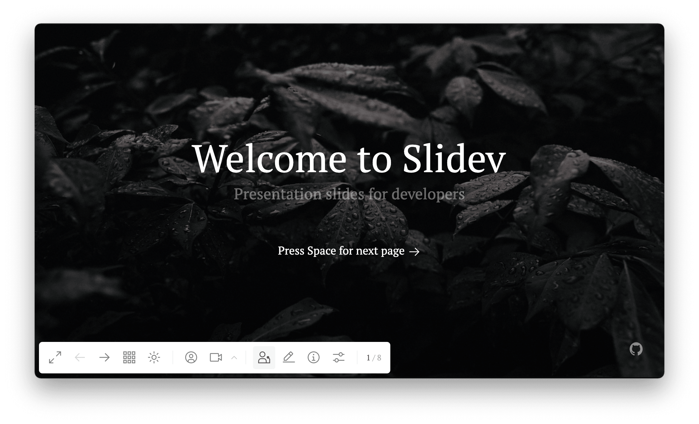

<!-- order:5 -->
## 导航

| 快捷键        | 按钮 | 说明                                                         |
| :------------ | :--- | :----------------------------------------------------------- |
| f             |      | 切换全屏                                                     |
| right / space |      | 下一动画或幻灯片                                             |
| left          |      | 上一动画或幻灯片                                             |
| up            | -    | 上一张幻灯片                                                 |
| down          | -    | 下一张幻灯片                                                 |
| o             |      | 切换 [幻灯片总览](https://cn.sli.dev/guide/navigation.html#slides-overview) |
| d             |      | 切换暗黑模式                                                 |
| -             |      | 切换 [摄像头视图](https://cn.sli.dev/guide/recording.html#camera-view) |
| -             |      | [演讲录制](https://cn.sli.dev/guide/recording.html#camera-view) |
| -             |      | 进入 [演讲者模式](https://cn.sli.dev/guide/presenter-mode.html) |
| -             |      | 切换 [集成编辑器](https://cn.sli.dev/guide/editors.html#integrated-editor) |
| -             |      | 下载幻灯片 (仅在 [单页（SPA）构建](https://cn.sli.dev/guide/exporting.html#single-page-application-spa) 中支持) |
| -             |      | 显示该演示文稿的信息                                         |
| -             |      | 显示设置菜单                                                 |
| g             | -    | 显示“前往...”                                                |
